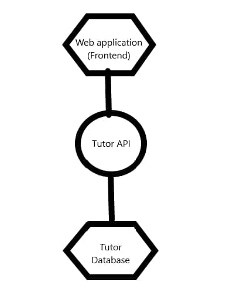

# 3.3 Management of tutor accounts
> ETI Assignment 2

## Introduction

**Package 3.3: Management of tutors account**
- 3.3.1 Create, view, update, delete tutor accounts. Info include: `TutorID`, `Name`, `Description`
- 3.3.2 List Tutors
- 3.3.3 Search for tutors (Incomplete)

---

## Design Consideration for Microservices

Management of tutor accounts is created based on two microservices: `Tutor` and `Frontend`. For the requirements stated above, all requires a user interface where the information can be displayed to administrator in order for them to view the information of the tutors. Thus, a microservice for the front-end web development to retrieve the information is essential.

Consideration #1: Independent microservice
>They, each run independently from one and other as a microservice. Capable of CRUD, the four main functions considered necessary to implement a persistent storage application, `create`, `read`, `update`, `delete`.

Consideration #2: Loosely coupled microservices
>In management of tutor accounts, the microservices are decoupled from each other, as the microservices handles easy task and logic. Hence, there is not a need for dependency of the microservices and would require the user to call from each microservices API to request/receive inputs from the respective microservice it is calling. 

Consideration #3: Persistent data storage of the information using `MySQL Workbench`
>Since the information required to store is fairly simple and straightforward, as there is only a need for storing of tutor's information. Thus, I have decided to use MySQL Workbench to implement the tutors database.

--- 
## Microservice Architecture Diagram
The microservice architecture diagram is implemented as shown in the diagram below. Consisting of web application which provides a user interface to view the tutor's information. The web application communicates with the Tutor's API microservice implemented using Go through the HTTP requests made to the API endpoint port.


---
## Instructions for setting up
### Deploying to Class server 
1. On the server, pull the three Docker images for the project from Docker Hub.

    ```
    docker pull iekbue/kaihui-frontend
    ```
    ```
    docker pull iekbue/kaihui-backend
    ```
    ```
    docker pull iekbue/kaihui-database
    ```
2. Run the containers.

    ```
    docker run -d -p 8010:80 iekbue/kaihui-frontend
    ```
    ```
    docker run -d -p 8011:8011 iekbue/kaihui-backend (Have issue with backend)
    ```
    ```
    docker run -d -p 8012:3306 iekbue/kaihui-database
    ```
    3. The front-end page will then be accessible on http://localhost:8010
